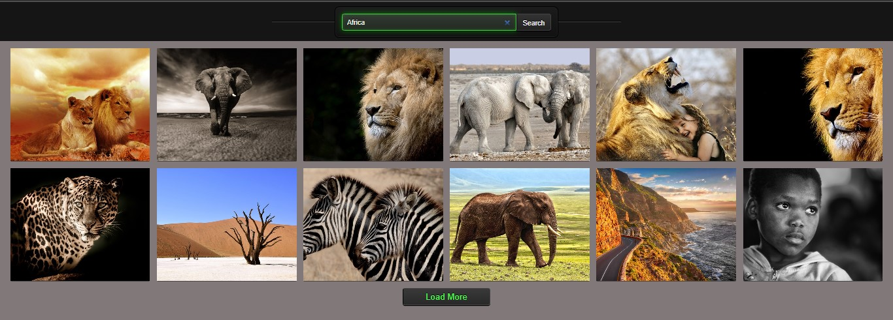

# 𝕀𝕞𝕒𝕘𝕖 𝕊𝕖𝕒𝕣𝕔𝕙 
## 𝕊𝕚𝕩𝕥𝕙 𝕣𝕖𝕒𝕔𝕥 𝕙𝕠𝕞𝕖𝕨𝕠𝕣𝕜  

  

This project was created using [Create React App](https://github.com/facebook/create-react-app).  

## 𝔽𝕖𝕒𝕥𝕦𝕣𝕖𝕤 𝕒𝕟𝕕 𝕋𝕖𝕔𝕙𝕟𝕠𝕝𝕠𝕘𝕚𝕖𝕤 ᎓  

</a>&nbsp;
  &nbsp;
  &nbsp;
  &nbsp;
  &nbsp;
  &nbsp;
  &nbsp;  

  An image search app with top-down loading and smooth scrolling up.    
  
※ @emotion/react and @emotion/styled: Styling library for React components.  
※ react-icons: to use icons in React.  
※ react-loader-spinner: to display standby mode.    
※ react-modal: implementation of a modal window in React.    
※ react-scroll-to: to quickly navigate to the top of the page.    
※ react-toastify: to use notifications.    

## 𝕀𝕟𝕤𝕥𝕒𝕝𝕝𝕒𝕥𝕚𝕠𝕟 ᎓  

To get started with this project, follow the installation instructions below.

1. Clone the repository:
   ```bash
   git clone https://github.com/Morifer79/react-image-search.git
   cd react-image-search-app
   ```
2. Install the dependencies:
   ```bash
   npm install
   ```
3. Start the development server:
   ```bash
   npm start
   ```
4. Open to view it in the browser:  
<a href="https://morifer79.github.io/react-image-search/"></a>

## 𝔼𝕞𝕒𝕚𝕝 𝕞𝕖 ᎓  
Questions, suggestions, help:  
<a href="mailto:cyber-morifer@proton.me"></a>
   

